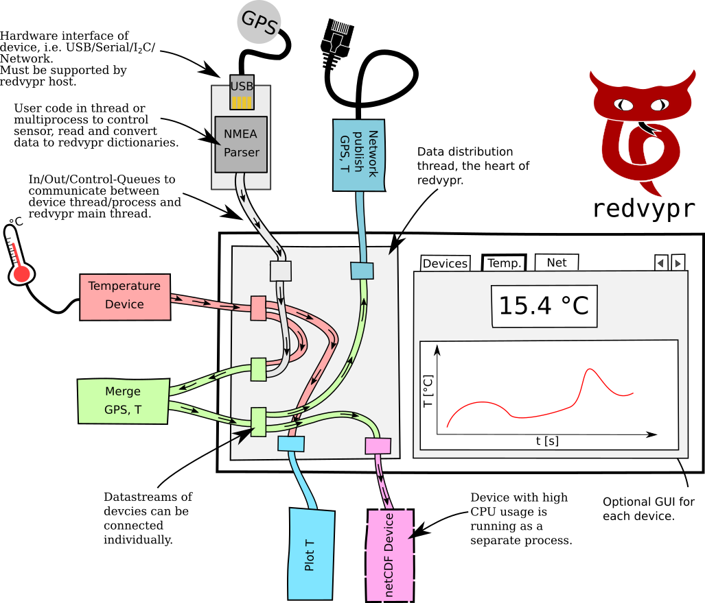

<h1 align="center"> </h1>

redvypr: Realtimedata viewer and processor (in python)
======================================================

Overview
--------
redvypr offers a python based framework to connect sensors and devices providing digital data and the possibilities to merge/process/save the data. See figure below for an artistic overview of the general structure of redvypr:

Introduction
------------

Sampling data from sensors does always require the similar tasks.

- Reading data from sensors
- Saving the data 
- Adding metainformation to the dataset, that typically includes
  information like time, location, experiment, responsible person(s),
  project ...
- Plotting data for a quicklook
- Do a first dataanalysis

Before the development of digital sensors these tasks have been
performed mainly by reading scales and documenting the data onto
paper. By the still continuing digitalisation of sensors, the number
of sensors and the amount of data output is increasing drastically,
which creates challenges in performing the above mentioned tasks,
especially if several sensors need to be fusioned, as they provide data
at transferred via different physical interfaces, different
frequencies, times and data formats:

Digital sensors have an non overseeable amount of interfaces like
UART, SPI, I2C, ethernet, to name a few, and their own data
format. Sensors are generally shipped with their own software for
sampling. The complexity starts if a user wants to fuse data from
several sensors in realtime. An often used approach is to merge the
data after the measurement. The data is typically located in several
files with different data formats. The users needs to read each data
format containing most likely different time stamps and data with the
complex task to synchronize the data and create a usable dataset.

Redvypr is a tool to help to work with digital sensors by providing a
[Python](https://www.python.org/) based infrastructure allowing to add sensors, interconnect
sensors, process and save the data gathered by the sensors. Python is
choosen as the language as it provides a rich infrastructure of
packets to deal with digital data and its interfaces, i.e. using
network devices, databases or serial connections. The extensive usage 
of [queues](https://docs.python.org/3/library/queue.html), [threads](https://docs.python.org/3/library/threading.html) and [multiprocesses](https://docs.python.org/3/library/multiprocessing.html) allows to work with asynchronously received data from
various sensors.

Redvypr was designed with the following goals in mind:
- Runs on small embedded systems
- Allows to work with asynchronously received data from multiple sensors
- Scalable by using several redvypr instances either on one computer or on a network
- Can be easily extended by users
- Setup via a configuration file and an optional GUI

Documentation
-------------
Find [here](https://redvypr.readthedocs.io) the documentation of redvypr.

